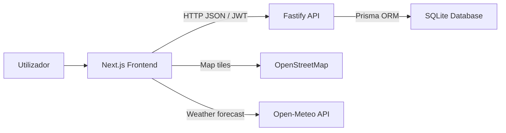

# CACA Platform

Refatorização e desenvolvimento da aplicação web do Centro Académico Clínico dos Açores (CACA), migrando a landing page e funcionalidades anteriores para uma arquitetura moderna com frontend em Next.js e backend em Node.js/Fastify.

## Identificação do Grupo

**Projeto Final - Tecnologias Web 2025/2026 | Grupo 6**

- **Nelson Pacheco Ponte** — 2024109237
- **Adriano Furtado Arruda** — 2024111815
- **David Cardoso** — número de aluno por preencher

## Tecnologias Escolhidas

### Frontend

- **Next.js:** escolhido por oferecer uma arquitetura moderna baseada em React, routing integrado, otimização de imagens, bom suporte a TypeScript e facilidade de evolução futura.
- **React:** permite dividir a interface em componentes reutilizáveis, facilitando a manutenção da landing page, formulários, mapas e páginas de autenticação.
- **TypeScript:** acrescenta tipagem estática, reduzindo erros em formulários, respostas da API e modelos de dados.
- **Tailwind CSS:** usado como utilitário moderno para apoiar estilos novos, mantendo em paralelo o CSS modular original para preservar a identidade visual.
- **Leaflet:** utilizado para mapas interativos com marcadores de eventos nas ilhas dos Açores.

### Backend

- **Node.js com Fastify:** escolhido pela performance, simplicidade, baixo overhead e excelente integração com TypeScript.
- **Zod:** validação de dados de entrada e schemas reutilizáveis para autenticação, perfis e respostas da API.
- **Prisma:** ORM moderno para modelação e acesso seguro à base de dados.
- **SQLite:** base de dados usada por defeito em desenvolvimento, simples de configurar e suficiente para o contexto académico. A arquitetura permite migração futura para PostgreSQL ou MySQL.
- **JWT:** autenticação stateless entre frontend e backend.
- **bcrypt:** hashing seguro de palavras-passe.
- **Helmet, CORS e Rate Limit:** camadas de proteção básicas para a API.
- **Swagger:** documentação interativa dos endpoints.

## Estrutura da Aplicação

```txt
.
├── backend/
│   ├── prisma/
│   │   ├── schema.prisma       # Modelos User, Event, ContactMessage e Newsletter
│   │   └── seed.ts             # Administrador, eventos e newsletter iniciais
│   └── src/
│       ├── config/             # Validação de variáveis de ambiente
│       ├── modules/
│       │   ├── auth/           # Autenticação
│       │   ├── users/          # Utilizadores, perfis e permissões
│       │   ├── events/         # CRUD de eventos
│       │   └── communications/ # Contactos e newsletter
│       ├── plugins/            # Prisma e JWT
│       ├── shared/             # Erros, roles, passwords e schemas comuns
│       ├── app.ts              # Configuração principal Fastify
│       └── server.ts           # Arranque HTTP
│   └── tests/                  # Testes unitários e de integração da API
├── frontend/
│   ├── public/assets/          # Imagens e logótipo CACA
│   ├── public/leaflet/         # Ícones locais dos marcadores do mapa
│   └── src/
│       ├── app/                # Rotas Next.js
│       ├── components/         # Componentes organizados por domínio
│       ├── data/               # Dados estáticos da landing e eventos
│       ├── lib/                # API client, storage, weather, utilitários e testes
│       ├── styles/             # CSS modular preservado do projeto original
│       └── types/              # Tipos TypeScript
├── .github/workflows/ci.yml    # Pipeline de validação automática
└── package.json                # Workspaces e scripts globais
```

### Comunicação Entre Camadas



- O utilizador interage com o frontend Next.js.
- O frontend comunica com a API Fastify através de pedidos HTTP em JSON.
- Após login ou registo, a API devolve um token JWT usado em rotas protegidas.
- O backend usa Prisma para ler e escrever dados na base de dados.
- O mapa e a meteorologia usam APIs externas diretamente no frontend.

## Funcionalidades Implementadas

### Funcionalidades Migradas dos Projetos Anteriores

- Landing page institucional do CACA migrada para componentes React.
- Preservação da identidade visual original: cores, tipografia, cartões, header, footer, secções e imagens.
- Secções principais: missão, áreas de investigação, notícias, parceiros, oportunidades, gráfico, contactos, newsletter e mapa.
- Menu responsivo com navegação mobile.
- Carousel da hero section reimplementado em React.
- Formulário de contacto com validação client-side, feedback ao utilizador e persistência na API.
- Newsletter com validação e persistência na API.
- Gráfico de oportunidades migrado para SVG acessível em React.
- Gestão de eventos com criação, edição, eliminação e listagem através do backend.
- Persistência de eventos na base de dados via Prisma.
- Mapa interativo com marcadores de eventos.
- Proteção de escrita na página de eventos: visitantes consultam eventos; utilizadores autenticados fazem CRUD.

### Novas Funcionalidades da API de Utilizadores

- Registo de novos utilizadores.
- Login com email e palavra-passe.
- Validação de palavra-passe forte no frontend e no backend.
- Geração de token JWT.
- Obtenção do perfil autenticado.
- Edição de perfil: nome, instituição, biografia e avatar.
- Modelo de permissões com roles `USER` e `ADMIN`.
- Listagem de utilizadores protegida para administradores.
- Alteração de permissões protegida para administradores.
- Painel `/admin` para gerir permissões, consultar mensagens de contacto e subscrições.
- Página de erro 404 e estado global de loading.
- Healthcheck `/health` com verificação real da ligação à base de dados.
- Documentação Swagger disponível em `/docs`.

## Como Correr a Aplicação

### Pré-requisitos

- Node.js instalado.
- npm instalado.

### Instalação

```bash
npm install
```

### Variáveis de Ambiente

Criar os ficheiros de ambiente a partir dos exemplos:

```bash
cp backend/.env.example backend/.env
cp frontend/.env.example frontend/.env.local
```

No Windows PowerShell, caso o comando `cp` não esteja disponível:

```powershell
Copy-Item backend/.env.example backend/.env
Copy-Item frontend/.env.example frontend/.env.local
```

### Base de Dados

Gerar o Prisma Client:

```bash
npm run db:generate --workspace backend
```

Criar/sincronizar a base de dados:

```bash
npm run db:push --workspace backend
```

Inserir o utilizador administrador inicial:

```bash
npm run db:seed --workspace backend
```

Credenciais criadas pelo seed:

- **Email:** `admin@caca.uac.pt`
- **Password:** `AdminCACA2026!`

### Execução em Desenvolvimento

Executar frontend e backend em simultâneo:

```bash
npm run dev
```

URLs principais:

- **Frontend:** `http://localhost:3000`
- **Backend:** `http://localhost:3333`
- **Swagger:** `http://localhost:3333/docs`

### Scripts Úteis

```bash
npm run dev              # Frontend + backend em paralelo
npm run dev:frontend     # Apenas Next.js
npm run dev:backend      # Apenas Fastify
npm run build            # Build completo
npm run lint             # Typecheck backend e frontend
npm run test             # Testes backend + frontend
npm run check            # Lint + testes + build
npm run db:studio        # Prisma Studio
```

## Endpoints Principais

- `POST /api/auth/register` — regista um novo utilizador.
- `POST /api/auth/login` — autentica um utilizador e devolve JWT.
- `GET /api/users/me` — devolve o perfil do utilizador autenticado.
- `PUT /api/users/me` — atualiza o perfil do utilizador autenticado.
- `GET /api/users` — lista utilizadores, apenas para `ADMIN`.
- `PATCH /api/users/:id/role` — altera permissões, apenas para `ADMIN`.
- `GET /api/events` — lista eventos.
- `POST /api/events` — cria evento autenticado.
- `PUT /api/events/:id` — atualiza evento do autor ou de administrador.
- `DELETE /api/events/:id` — elimina evento do autor ou de administrador.
- `POST /api/contact` — regista mensagem de contacto.
- `GET /api/contact` — lista mensagens, apenas para `ADMIN`.
- `POST /api/newsletter` — regista subscrição da newsletter.
- `GET /api/newsletter` — lista subscrições, apenas para `ADMIN`.

## Decisões de Design e Implementação

- A aplicação foi organizada como monorepo para manter frontend e backend no mesmo repositório, mas com responsabilidades separadas.
- O CSS original foi preservado e reorganizado dentro do frontend para manter o estilo visual já estabelecido.
- A landing page foi dividida em componentes React para facilitar manutenção e expansão.
- A gestão de eventos foi migrada para a API para demonstrar CRUD completo, integração assíncrona e persistência real.
- A gestão de utilizadores, mensagens e newsletter foi movida para uma API real por envolver dados que devem persistir e ser moderados.
- O backend foi estruturado por módulos (`auth`, `users`, `events` e `communications`) com separação entre rotas, controllers, schemas e services para permitir crescimento futuro.
- A validação foi centralizada com Zod para reduzir duplicação e rejeitar dados inválidos antes da lógica de negócio.
- O Prisma foi escolhido para abstrair a base de dados e permitir troca futura de SQLite para PostgreSQL/MySQL com impacto reduzido.
- Os testes foram divididos entre unidade e integração: schemas/rotas no backend e utilitários críticos no frontend.
- O projeto inclui pipeline GitHub Actions para instalar dependências, gerar Prisma Client, correr lint, testes e build a cada push ou pull request.

## Desafios e Soluções

- **Migração de HTML estático para React:** a solução passou por decompor a página em secções/componentes mantendo as classes CSS originais.
- **Preservação do estilo visual:** os assets e ficheiros CSS foram reaproveitados em `frontend/src/styles`, evitando redesenhar a interface.
- **Separação entre UI e dados persistentes:** o frontend mantém apenas estado de apresentação; utilizadores, eventos, contactos e newsletter são persistidos no backend.
- **Integração do mapa com Next.js:** o Leaflet é carregado apenas no cliente para evitar conflitos com renderização do lado do servidor.
- **Segurança dos formulários:** validação no frontend para feedback rápido e validação no backend para garantir integridade real dos dados.
- **Avatar do perfil:** o upload é tratado no cliente como imagem pequena em Data URL e validado antes de ser enviado para a API.
- **Testes de integração:** a API é exercitada com `app.inject`, testando registo, login, atualização de perfil, permissões, eventos, contactos e newsletter.

## Acessibilidade, Responsividade e Segurança

### Acessibilidade

- Uso de HTML semântico com `header`, `main`, `section`, `article`, `nav` e `footer`.
- Imagens principais com texto alternativo.
- Botões e formulários com labels ou `aria-label`.
- Estados de foco visíveis através do CSS.
- Link "Saltar para o conteúdo principal" para navegação por teclado.
- Gráfico SVG com `role="img"` e descrição acessível.
- Mapa marcado como região navegável por teclado.
- Menu mobile com `aria-expanded` e `aria-controls`.

### Responsividade

- Layout adaptável com CSS Grid e Flexbox.
- Breakpoints herdados do projeto original.
- Header responsivo com menu hamburger.
- Cartões, formulários e mapas adaptados para ecrãs pequenos.
- Imagens otimizadas através do componente `Image` do Next.js.

### Segurança

- Passwords nunca são guardadas em texto simples; são protegidas com bcrypt.
- Autenticação baseada em JWT.
- Rotas protegidas verificam token antes de devolver dados sensíveis.
- O frontend redireciona para login quando o perfil exige sessão válida.
- Permissões `ADMIN`/`USER` aplicadas em endpoints administrativos.
- Validação de input com Zod no backend.
- Proteção HTTP com Helmet.
- CORS configurado para a origem do frontend.
- Rate limit global e limites mais apertados nas rotas de autenticação, contacto e newsletter.
- Conteúdo dinâmico dos popups do mapa é escapado antes de ser injetado.
- Administradores não conseguem remover a própria permissão por acidente.

## APIs Externas Utilizadas

### Open-Meteo

Usada para consultar previsões meteorológicas associadas à criação de eventos. A integração está no frontend e usa latitude/longitude das ilhas para obter temperatura e estado do tempo.

- Endpoint base: `https://api.open-meteo.com/v1/forecast`
- Ficheiro principal: `frontend/src/lib/weather.ts`

### OpenStreetMap + Leaflet

Usados para apresentar mapas interativos e marcadores dos eventos nos Açores.

- Leaflet cria o mapa e os marcadores.
- OpenStreetMap fornece os tiles do mapa.
- Os ícones do Leaflet foram copiados para `frontend/public/leaflet` para evitar dependência de CDN nos marcadores.
- Ficheiro principal: `frontend/src/components/map/EventsMap.tsx`

## Validação

Foram executados com sucesso:

```bash
npm run lint
npm run test
npm run build
npm run db:generate
```

Cobertura funcional validada:

- Testes backend: schemas de autenticação e fluxo integrado de registo/login/perfil/permissões/eventos/contactos/newsletter.
- Testes frontend: sanitização de HTML e gestão da sessão local.
